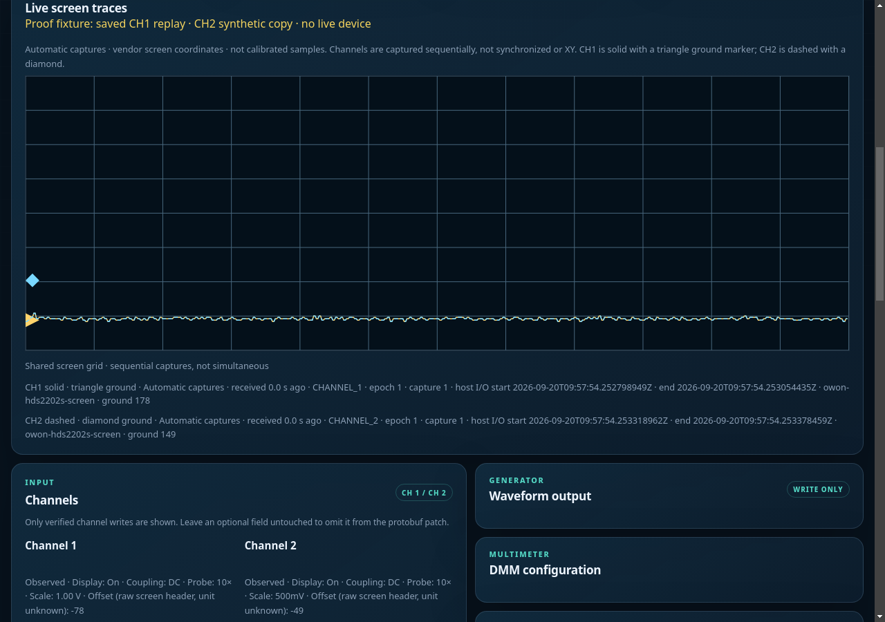
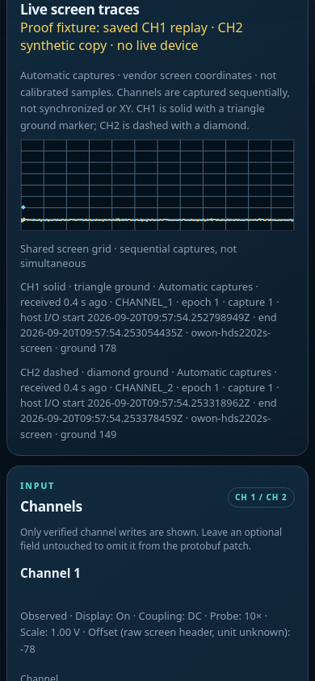

# OWON Control

Control an **OWON HDS2202S** over USB from your browser, CLI, or gRPC.



*Actual built WebUI replaying saved CH1 bytes through the controller, RPC and HTTP stream. CH2 is a synthetic copy; no live device is connected.*

## Quick start (Linux)

Install Go 1.26+. On Debian/Ubuntu, install dependencies:

```sh
sudo apt install git build-essential pkg-config libusb-1.0-0-dev usbutils
git clone https://github.com/xaionaro-go/owon.git
cd owon
```

Plug in your instrument and [grant USB access](docs/setup.md#usb-access).
Run these in separate terminals from the checkout:

```sh
go run ./cmd/owond
```

```sh
go run ./cmd/owonweb
```

Open **<http://127.0.0.1:8080/>**. Stop both processes with Ctrl+C when finished.
One matching instrument is auto-detected. With several connected, add `--serial SERIAL`; the error lists their serials.
The daemon and clients share a private per-user Unix socket; no socket setup or address flags needed.
For CLI access while the daemon runs:

```sh
go run ./cmd/owonctl info
```

The WebUI automatically displays both channels using vendor screen coordinates for the supported HDS2202S screen profile. These traces are not calibrated samples or synchronized captures. Raw bytes and headers remain available; other profiles show an explicit unavailable reason. Other models and firmware may differ.

- [USB access, troubleshooting, and systemd setup](docs/setup.md)
- [CLI, API, remote connections, and device limitations](docs/reference.md)
- [Home Assistant integration](docs/home-assistant.md)
- [Development and tests](docs/development.md) · [gRPC schema](pkg/owonrpc/owon.proto) · [USB protocol evidence](docs/usb-protocol.md)

<details>
<summary>WebUI at phone width</summary>



Actual built WebUI with the same saved-CH1 replay and synthetic CH2 copy; not live-device acquisition.

</details>

License: [CC0 1.0 Universal](LICENSE). Dependencies retain their own licenses.
